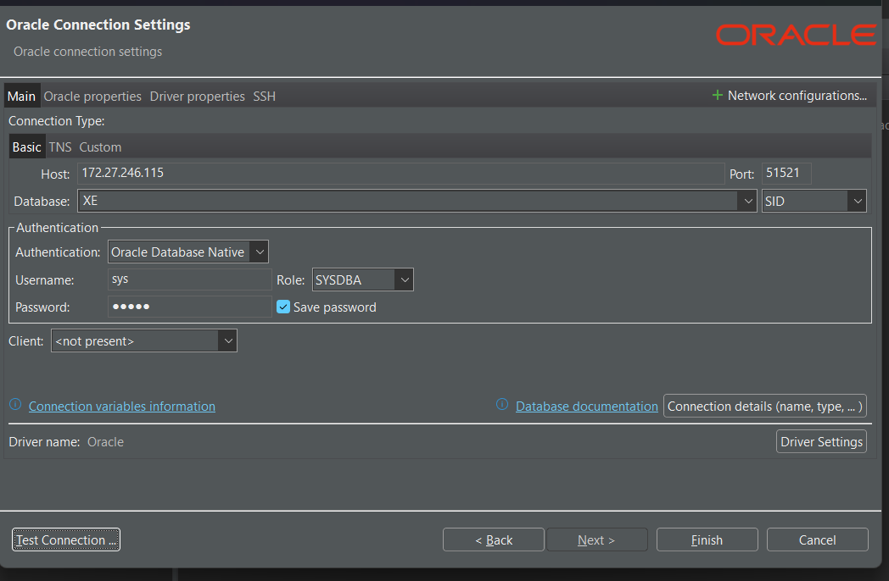

# Configurando o Banco de Dados Oracle com Docker

Este repositório fornece um ambiente Docker para subir um banco de dados Oracle XE 21.3.0.

## Como configurar

### 1. Clonar o repositório

```sh
git clone <URL_DO_REPOSITORIO>
cd <NOME_DO_REPOSITORIO>
```

### 2. Construir a imagem Docker

Acesse o diretório `dockerOracle` e execute o seguinte comando:

```sh
cd DockerOracle
./buildContainerImage.sh -v 21.3.0 -x
```

**Atenção:** Esse processo pode demorar.

### 3. Validar se a imagem foi criada corretamente

Depois de finalizada a construção da imagem, execute:

```sh
docker images
```

Verifique se a imagem `oracle/database:21.3.0-xe` aparece na lista.

### 4. Subir o container

Para iniciar o container com Oracle XE, execute:

```sh
docker-compose up -d
```

Isso iniciará o banco de dados Oracle no container.

Para parar o container, execute:

```sh
docker-compose down
```

Isso iniciará o banco de dados Oracle no container.

## Conectando no DBeaver

1. Abra o DBeaver.
2. Clique em **Nova Conexão**.
3. Escolha **Oracle** como o tipo de banco.
4. Insira as seguintes informações:
   - **Host:** `localhost`
   - **Porta:** `51521`
   - **Database:** `XE` com o tipo `syd`
   - **Usuário:** `sys`
   - **Senha:** `SENHA`
5. Clique em **Testar Conexão** para validar.
6. Se estiver tudo correto, clique em **Finalizar**.


## Acessando o banco direto do container:
```sh
docker exec -it --user=oracle oracle bash
sqlplus sys@XEPDB1 as sysdba
```

## Importando o Banco de Dados

Para popular o banco de dados, é necessário rodar o script SQL do arquivo `dump.sql` **parágrafo por parágrafo** no DBeaver. Isso evita erros durante a execução.

1. Abra o arquivo `dump.sql` no DBeaver.
2. Execute cada bloco de instrução separadamente.
3. Confirme que os dados foram inseridos corretamente rodando consultas de validação.

Após isso, o banco estará pronto para uso!

